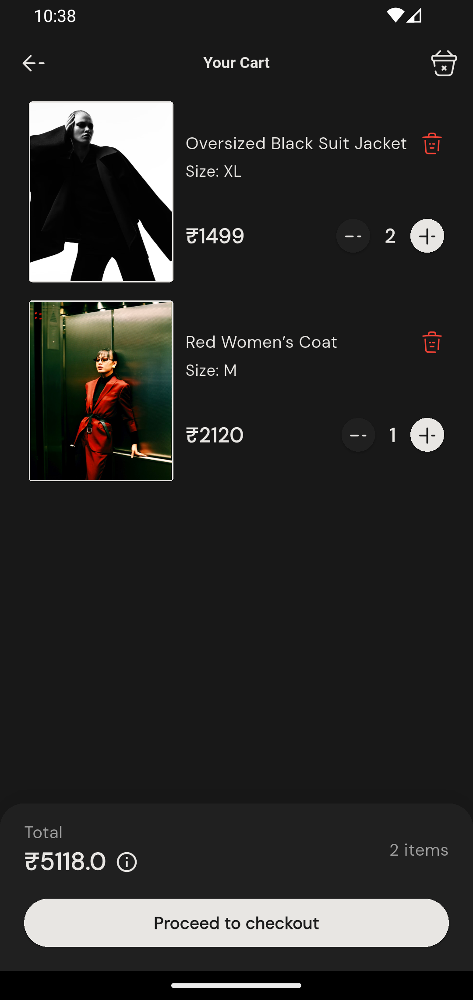
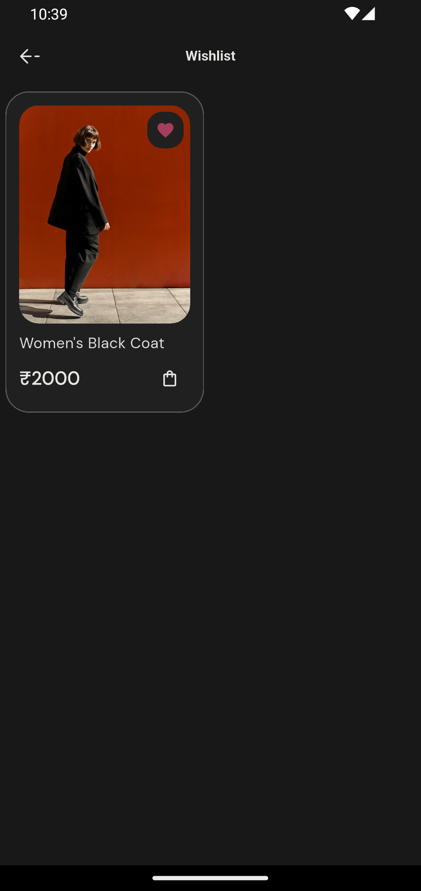

# Dripzy

Dripzy is a high-end E-commerce mobile application built with Flutter, focusing on a minimalist aesthetic and high-performance focus. It provides a seamless shopping journey with a clean interface and robust architecture.

## Visuals

<p align="center">
  
  
  
</p>

<p align="center">
  
  
  
</p>

## Core Features
- **State Management**: Predictable state handling using the `flutter_bloc` pattern.
- **Declarative Routing**: Dynamic and deep-link ready navigation powered by `go_router`.
- **Product Discovery**: Optimized catalog browsing for Men, Women, and Kids categories.
- **Dynamic Cart & Checkout**: Responsive cart management and a streamlined checkout flow.

## Tech Stack
- **Frontend**: Flutter (Dart)
- **Backend**: Node.js (Express)
- **Database**: MongoDB
- **Media Storage**: Cloudinary

## Technical Folder Structure
```text
lib/
├── blocs/          # Business logic and state handling
├── core/
│   ├── router/     # Routing configuration (go_router)
│   └── utils/      # Utility functions and helpers
├── models/         # Data models and JSON serialization
├── repositories/   # Data abstraction layer for APIs
├── screens/        # Feature-specific UI screens
└── widgets/        # Reusable presentation components
```

## Backend Link
The backend source code for Dripzy is hosted at:
[https://github.com/TechSmith90210/dripzy-backend](https://github.com/TechSmith90210/dripzy-backend)
